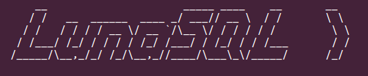

*LunaSQL* - a fair SQL shell client
===================================

<!-- TABLE OF CONTENTS -->
<details>
  <summary>Table of Contents</summary>
  <ol>
    <li><a href="#about-the-project">About The Project</a></li>
    <li><a href="#features-and-motivation">Features and motivation</a></li>
    <li><a href="#getting-started">Getting started</a></li>
    <li><a href="#how-to-contribute">How to contribute</a></li>
    <li><a href="#external-libraries">External libraries</a></li>
    <li><a href="#checking-integrity">Checking integrity</a></li>
    <li><a href="#license">License</a></li>
  </ol>
</details><br />

[](https://github.com/myxcel/lunasql/actions/workflows/ant.yml) -
[](https://github.com/myxcel/lunasql/releases/tag/latest)
[](https://github.com/myxcel/lunasql/releases/latest) -
[](https://github.com/myxcel/lunasql/discussions)
[](https://github.com/myxcel/lunasql/wiki)
[](https://github.com/myxcel/lunasql/issues)

## About the project

Another naive but positive and fun Java JDBC SQL shell client. Designed to simply query databases by JDBC, or automate database tasks and prototype applications before real implementation.

This is an old personal project that I used to develop occasionally, and that I just put on GitHub under an opensource license, but the development started in 2009! So please bear with me as to the quality of the code. It works, and it can be useful!

## Features and motivation

  * connects to any database by JDBC driver,
  * sends SQL commands to database server,
  * adds predefined useful commands and macros,
  * is highly configurable by command line or file,
  * accepts user-defined macros and command plugins,
  * evaluates expressions by JSR-223,
  * embeds a minimalistic graphical IDE,
  * includes an HTTP server for remote querying,
  * secures scripts execution by digital signature,
  * provides useful javascript scripting libraries,
  * sources recently released on GitHub,
  * only one (small) jar file!

## Getting started

LunaSQL is released as a jar file, which can be run using [H2 Database driver](https://h2database.com/html/main.html) as a minimalistic command with:
```
java lunasql.Main --type=H2DB --name=path/to/base/MyDB --user=sa --password="" --console
```

**Important note about the Nashorn JSR-223 script engine**: since Java 15, the Nashorn script engine (Javascript eveluation engine) was removed from the JRE distribution. As result, in order to evaluate control commands or javascript libraries, it is now mandatory to add an external library, like [Rhino](https://github.com/mozilla/rhino) or [Nashorn](https://github.com/openjdk/nashorn). Other JSR-223 engines like [beanshell](https://github.com/beanshell/beanshell) [Jython](https://github.com/jython/jython), [JRuby](https://github.com/jruby/jruby) or [clojure](https://github.com/clojure/clojure) can also fit for evaluations.

To build the distribution, just run the [ant](https://ant.apache.org) task (you may have to adapt the `path id="classpath"` entry):

```
ant dist
```

## How to contribute

Any help will be greatly appreciated! You can contribute by using the application and testing it, [reporting new issues](https://github.com/myxcel/lunasql/issues). You can also try to work on [good first issues](https://github.com/myxcel/lunasql/contribute). Don't forget that the [Discussions page](https://github.com/myxcel/lunasql/discussions) warmly welcomes you to say hello or discuss about new ideas, questions...

## External libraries

See the [src/lunasql/doc/libraries.txt](https://github.com/myxcel/lunasql/blob/master/src/lunasql/doc/libraries.txt). Thank you to all libraries contributors for your good job!

## Checking integrity

First, commits are signed with PGP key fingerprint `466F B094 B95C 3589` (until 2023: `2EA0 CCE6 2860 3945`) and are automatically verified by GitHub.

## License

LunaSQL is distributed under the CeCILL License. See the [french](http://cecill.info/licences/Licence_CeCILL_V2.1-fr.html) or [english](http://cecill.info/licences/Licence_CeCILL_V2.1-en.html) versions for further details.

If you like LunaSQL, please remember it's maintained in my free time, and... [buy me a coffee](https://gist.github.com/myxcel/bcbddb4a2429e2fc84dc5f813ad5a87e#file-support-md) ❤️
